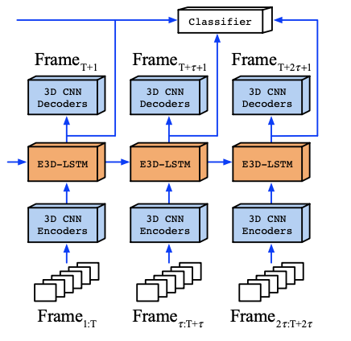
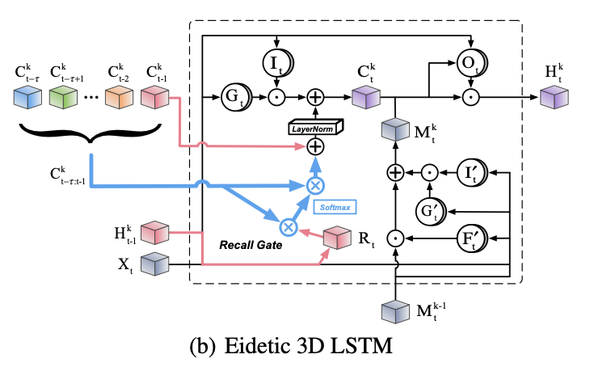

## E3DLSTM

This is an implementation based on the paper <a href="https://openreview.net/forum?id=B1lKS2AqtX">Eidetic 3D LSTM: A Model for Video Prediction and Beyond </a> 

This model is quite similar to <a href="https://dl.acm.org/doi/10.5555/3294771.3294855">PredRNN </a> in a way that both of them makes use of a new type of memory cell M. The difference is that E3DLSTM performs 3D conv on a windows of consecutive frames to extract temporal information. Moreover, E3DLSTM introduced a new type of gate called Recal which make uses of self-attention machenism on memory cell C, which allows the model to extract useful information throughout all historical timesteps. 

 

- Single E3DLSTM cell

 
 

- E3DLSTM architecture

 

### Result
- Due to limited resource, there are still no experiments conducted to assess the correctness of the implementation. The program crash because CUDA out of memory (due to self-attention machenism which require large GPU memory). 
- Result will be updated later once experiment is conducted.
